← **[Back to main portfolio](../index.html)**

**[Read the project overview here](spotify-analysis.html)**

# Spotify Listening Behaviour Analysis -  Full Report

## Abstract

This assignment investigates personal Spotify listening behaviour using
exploratory data analysis and unsupervised machine learning techniques.

---

## 1. Executive Summary

Personal music listening behaviour is complex, habitual, and context dependent, yet is rarely examined using formal analytical techniques at the individual level. This project addresses the challenge of uncovering recurring patterns in personal music listening behaviour through unsupervised learning.  The analysis answers the central question of whether distinct listening day archetypes exist and whether these can be leveraged to support personalised recommendation outcomes.

The dataset comprises event level streaming records extracted from Spotify’s Extended Streaming History export, spanning several years, enriched with audio and genre metadata sourced from Spotify’s developer ecosystem and a supplementary open source dataset. After ingestion and cleansing, individual listening events were aggregated to the day level and transformed into a structured feature set capturing temporal listening patterns (hour of day distributions), acoustic characteristics (Tempo, Valence and more), and artist preferences derived using TF IDF vectorisation and dimensionality reduction.  Particular attention was paid to ensuring that feature construction reflected behavioural patterns rather than total listening volume, allowing comparability between light and heavy listening days. 

Given the unlabelled and exploratory nature of the data, K means clustering was selected as the primary modelling approach. Evaluation using silhouette analysis indicated that a three cluster solution provided an effective balance between internal validity and interpretability. The resulting clusters represent distinct listening day archetypes, differentiated by time of day listening behaviour, musical energy profiles, and artist composition. Principal Component Analysis confirms clear separation between clusters and supports interpretation of the dominant behavioural dimensions. Longitudinal analysis further reveals sustained shifts in cluster prevalence over time that align with contextual changes in account usage, indicating structural changes in listening behaviour rather than short term variability.

The analytical findings were translated into a practical application through a cluster conditioned playlist generation process, producing three distinct, non overlapping playlists representative of each listening day archetype.  Overall, the project presents a reproducible and privacy aware framework for transforming personal behavioural data into interpretable segments and actionable recommendation outputs, illustrating the broader value of unsupervised learning for analysing complex, real world behavioural datasets.

---

## 2. Project background

Music listening habits offer insights into mood and behavioural patterns, supporting self-reflection by revealing habitual consumption trends. This project examines a personal Spotify listening history with the primary objective of identifying natural listening-day archetypes characterised by interpretable temporal, acoustic, and genre-based features. A secondary objective is to generate personalised playlists conditioned on day type and time of day, where consistent patterns emerge. Although the data is not sensitive in a conventional organisational sense, it comprises personal behavioural records and therefore requires careful handling. 

---

## 3. Data Infrastructure and Tools

The dataset was sourced from a shared household Spotify account via Spotify’s export function. The full Extended Streaming History (Figure 1) was chosen over the 12-month subset to allow longitudinal analysis of changes in listening behaviour. After a 30-day processing period, Spotify provided a time-limited download link (Figure 2) to access ten JSON files spanning 2013–2026, which were saved locally to avoid expiration. 

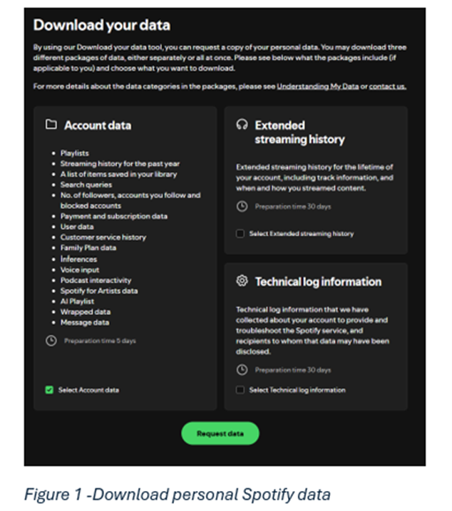

To enrich the dataset, a Spotify for Developers account was configured to retrieve artist genre labels and track-level audio features (e.g. tempo, danceability, loudness. Appendix 3) through the Spotify Web API (Figures 3 and 4). This required creating a Spotify application (Client ID and Secret) to obtain access tokens, with credentials managed on the developer dashboard. 

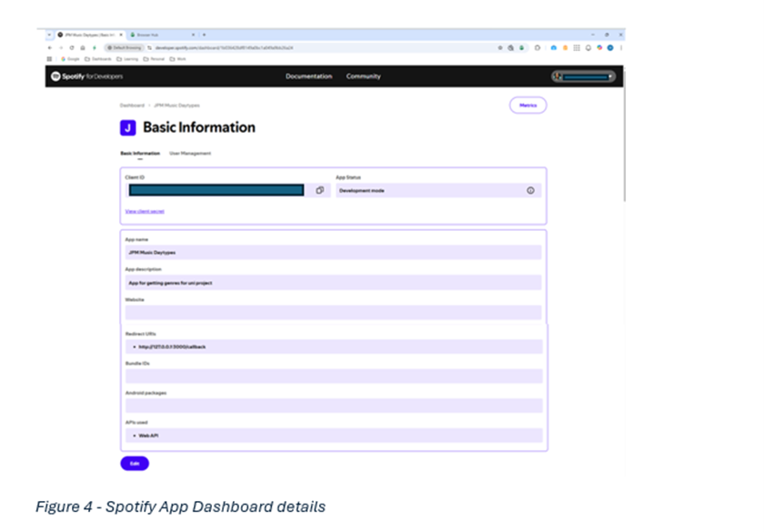

Although Teradata RDBMS was considered for its ingestion and feature-engineering capabilities, its advantages (scalability, performance, enterprise security) were unnecessary given the dataset’s modest size and personal context. Python was chosen for its robust analytics ecosystem and ability to handle the entire workflow, from ingestion through to cleansing, EDA, modelling, validation, and output generation. While a hybrid Teradata–Python approach can be beneficial for larger scale data (Muddarla & Vatti, 2024), Python alone sufficed for this analysis. 

Corporate certificate restrictions prevented direct use of the Spotify API, necessitating a contingency for metadata enrichment. A two-year-old track metadata dataset from HuggingFace (maharshipandya/spotify-tracks-dataset; c125 genres, Appendix 1–2) was used, despite partial coverage (c27.5% match rate).

Ethically, the study was confined to the author’s own listening data to minimise privacy risk and avoid inferring other individuals’ behaviour. As behavioural data can reveal personal routines, such as consistent listening times revealing commuting patterns, outputs were restricted to aggregated forms (day-level summaries, cluster profiles) rather than raw timestamps or location proxies. Spotify API credentials were secured using a password-manager-style method (Spotipy package) to minimise exposure risk and ensure compliance with privacy standards.  While this project is personal, similar pipelines (Python for ETL, API integration) are widely applicable in enterprise data environments.

---

## 4. Data Engineering

Spotify’s Extended Streaming History JSON files were consolidated into an event-level dataset by parsing all Streaming_History_Audio_*.json files and normalising nested structures (Figure 5). 

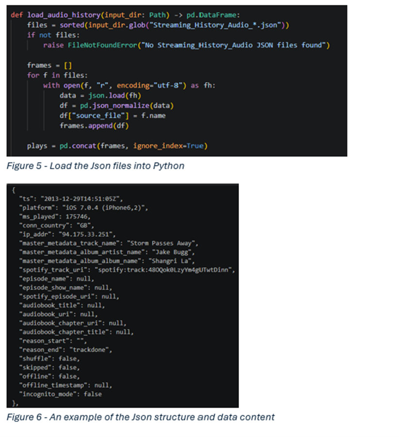

Following best practice for behavioural timestamp analysis (Smith, 2020), timestamps were converted from UTC to Europe/London local time to derive consistent temporal features (date, hour, day-of-week), and playback duration was converted from milliseconds to minutes (Figure 7). Device information was simplified into broad categories based on platform and user-agent strings to aid cluster interpretation. 

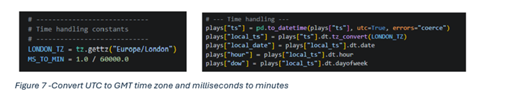

The dataset was filtered to music listening only by excluding podcast and video entries (identified via episode fields and file provenance), ensuring the clustering task reflected music behaviour (Figure 8).  

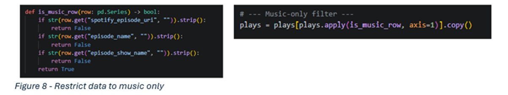

These preprocessing steps improved construct validity by focusing on comparable events, reduced noise from mixed media content, and yielded stable, standardised features suitable for unsupervised modelling without ground-truth labels. The end-to-end data engineering pipeline is summarised in Figure 9. 

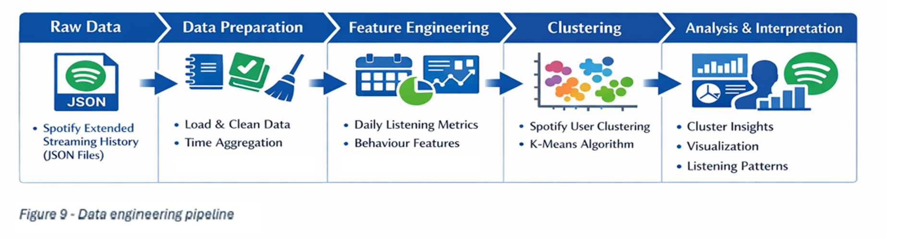

---

## 5. Data Analytics and Visualisation

Clustering was chosen as the primary analytical approach because the dataset is unlabelled, high-dimensional, and exploratory. With no predefined target labels, supervised learning was inappropriate. Unsupervised clustering groups observations by feature similarity, allowing latent structures to emerge without prior assumptions (Hastie et al., 2017). This makes clustering particularly suitable for personal music data, where recurring listening modes may exist but are not explicitly labelled. 
Choosing the right clustering technique was critical for validity and interpretability.

K-means was considered due to its simplicity, speed, and effectiveness when clusters are of regular shape and size, making it suitable for patterns anchored around consistent days and times and scalable across multi-year data. However, K-means can be distorted by outliers, like unusually short or long listening days, so alternative methods were evaluated. Figure 10 provides an author-compiled comparison of techniques, highlighting assumptions (cluster shape), noise sensitivity, interpretability, and complexity for each (Jain, 2010). 

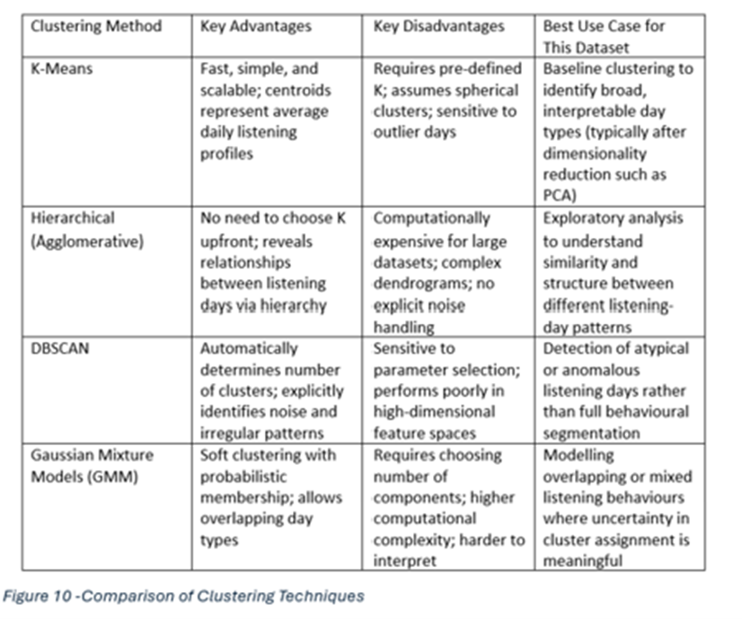

This comparative evaluation, alongside the scikit-learn packages ability to support the selection of K through elbow and silhouette plots, guided the decision to proceed with K-means, acknowledging its limitations while leveraging its practicality. 

Exploratory Data Analysis confirmed data quality and guided feature design. A time series of daily listening minutes identified a gap in 2018 due to use of another platform, and a sharp increase from 2019 onward coinciding with a transition to a shared account. 

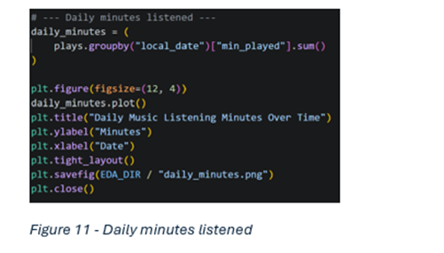
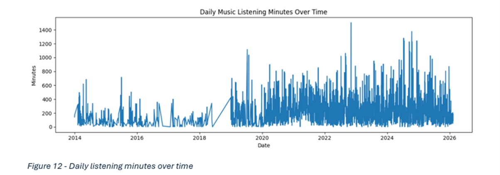

A heatmap of listening by day-of-week and hour-of-day (with minutes normalised to percentages) showed listening concentrated in evenings, dinner hours, and late nights, particularly on weekends, justifying inclusion of a 24-hour temporal distribution as a feature.

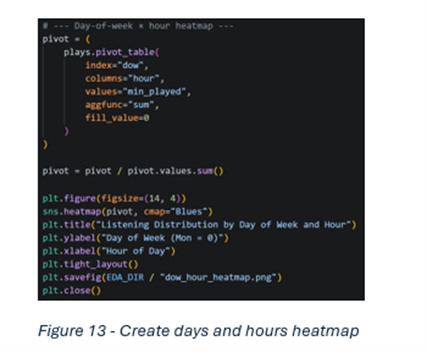
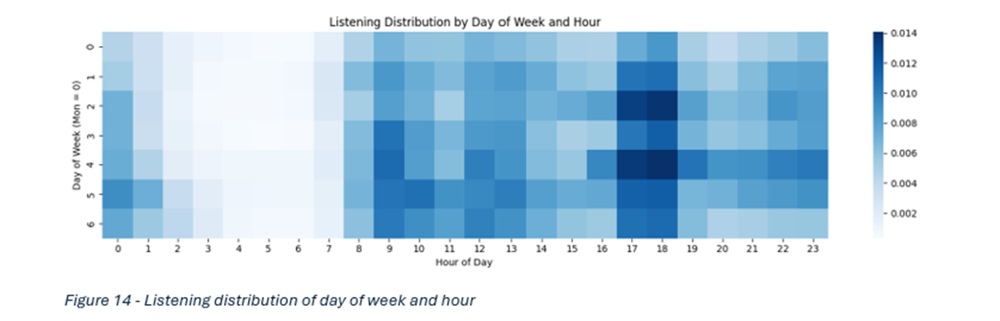

Histograms of key audio features (danceability, energy, valence, tempo) indicated distributions suitable for distance-based clustering, with no extreme skew or anomalies (detailed feature descriptions in Appendix). 

Feature Engineering was performed by transforming daily listening data into a modelling dataset combining temporal, acoustic, and artist-preference features. Temporal features captured each day’s distribution of listening across 24 hours ensuring heavy and light listening days remain comparable by pattern. Acoustic features summarised each day’s audio profile using the mean and standard deviation of audio attributes.

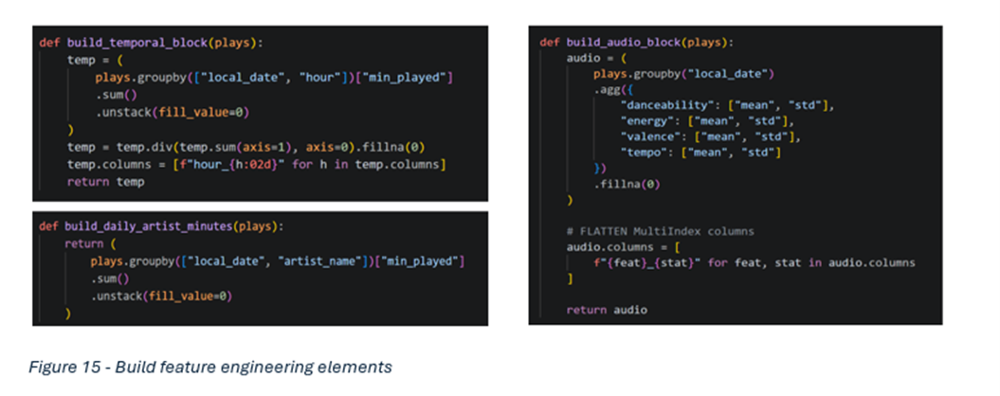

To address high artist cardinality (>10,000 unique artists), a day by artist matrix was constructed, with each day encoded as a high dimensional artist incidence vector. TF–IDF vectorisation was applied to down-weight commonly listened to artists and emphasise distinctive ones, and Truncated SVD compressed this representation to 30 dimensions, ensuring days with similar artist patterns remained close even without exact overlaps (Hastie et al., 2017). 

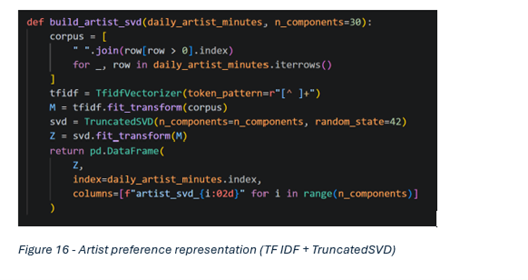

StandardScaler was then applied to produce z-score scaling to normalize value ranges prior to modelling. 

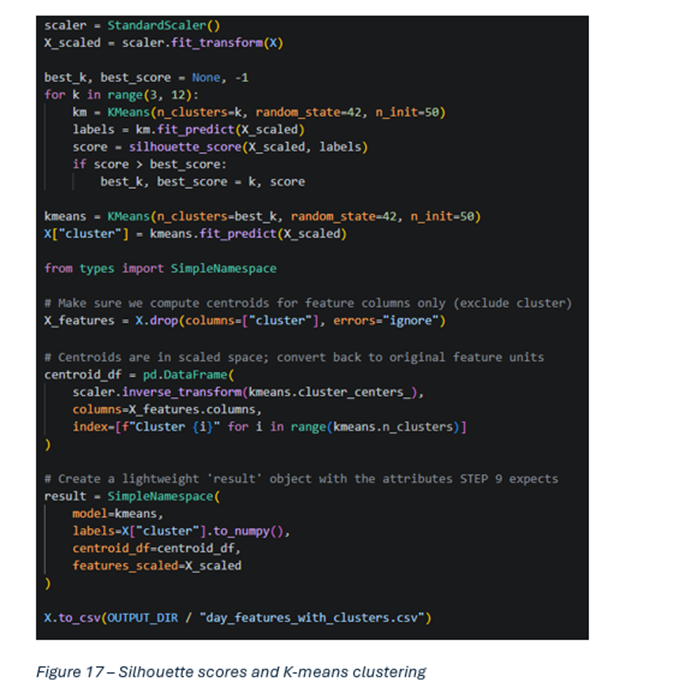

K-means clustering was applied using these features. Silhouette analysis (Figure 18) indicated that while K=2 achieved the highest mean silhouette score, K=3 yielded a comparable value with greater behavioural interpretability, by contrast, higher K values showed rapidly declining silhouettes indicating diminishing cluster cohesion and separation (Shutaywi & Kachouie, 2021).  A three-cluster solution was selected as an optimal balance between cluster validity and meaningful segmentation.  

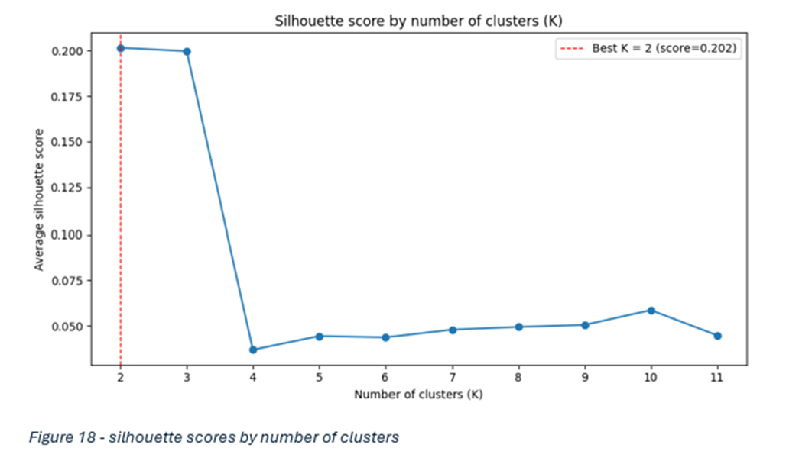

The clusters were interpreted and labelled based on distinguishing centroid characteristics such as time of day peaks and weekday vs weekend dominance, rather than numeric labels (Figure 19). 

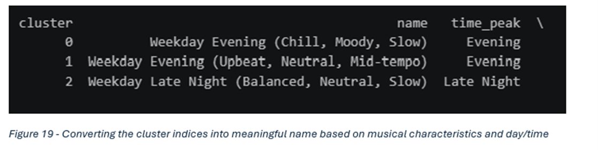

Principal Component Analysis (PCA) of the clustered data (Figure 20) confirmed clear separation among clusters, driven primarily by PC1 (late-night vs evening-centric days) and PC2 (energy/valence differences), consistent with expected behavioural dimensions. 

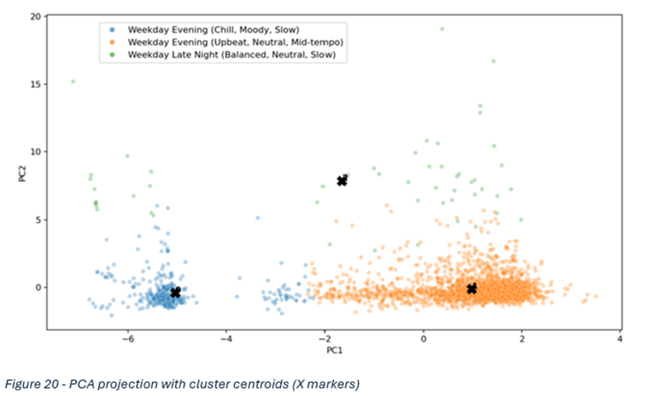

Analysing cluster membership over time (Figure 21) revealed significant shifts in listening behaviour.

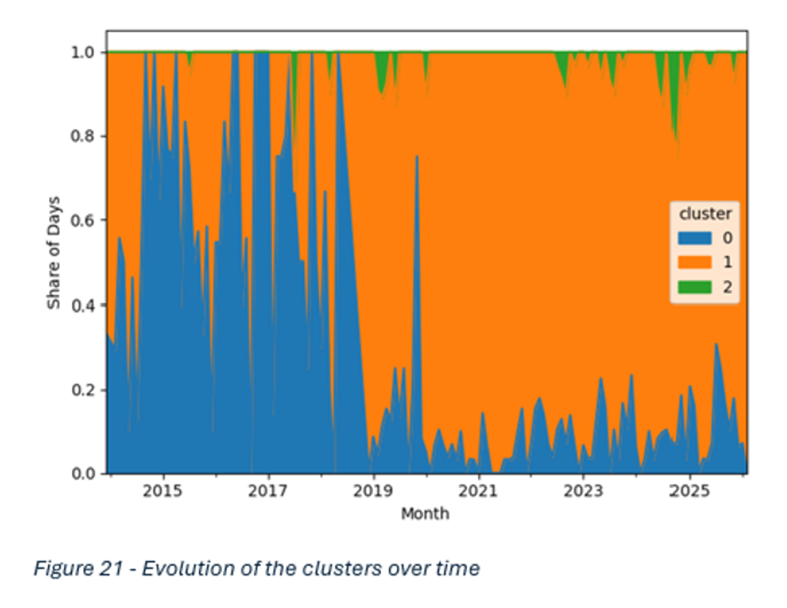

The transition to a shared household account in early 2019 corresponded to a persistent change in dominant listening-day types, a structural shift rather than a transient fluctuation. Other major life events including the birth of a first child and a household relocation, coincided with periods of reduced diversity in day types and a greater predominance of late-night, lower-energy listening days (Figure 22). Incorporating these contextual overlays exemplifies a mixed-methods approach, where qualitative context enhances interpretation of quantitative outputs without altering the underlying model results (Creswell & Plano Clark, 2018; Hands, 2022). 

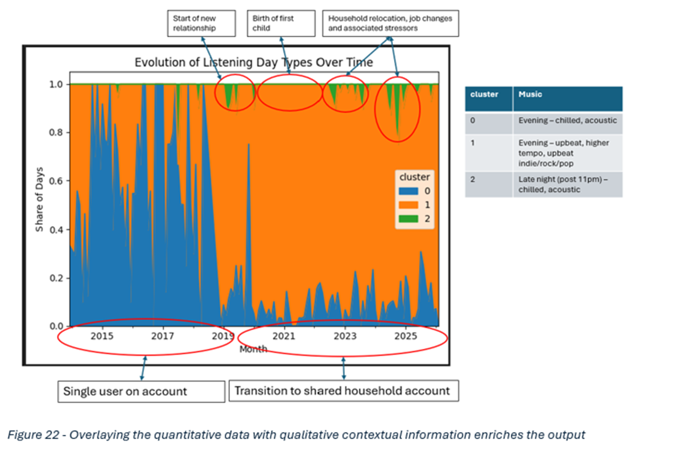

To demonstrate practical utility, a cluster-conditioned playlist generation process was implemented. Each day’s cluster label was first mapped to its individual track records, tagging tracks with the behavioural context of their day. For each cluster, unique track–artist pairs were aggregated along with their audio feature profiles. The cluster’s centroid in audio feature space was calculated, and cosine similarity was used to rank tracks by proximity to this centroid, a common approach in content-based music recommendation (Bonnin & Jannach, 2014). The top 30 tracks per cluster were then selected, with no track repeated across playlists, to create three distinct, non-overlapping playlists, each representing one listening-day archetype (Figures 23–25). 

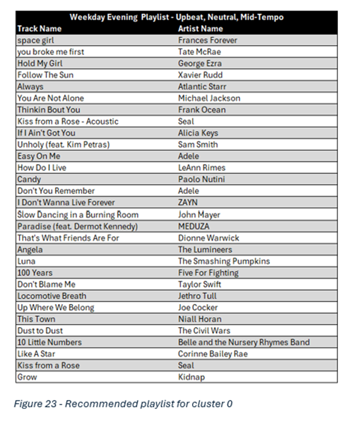
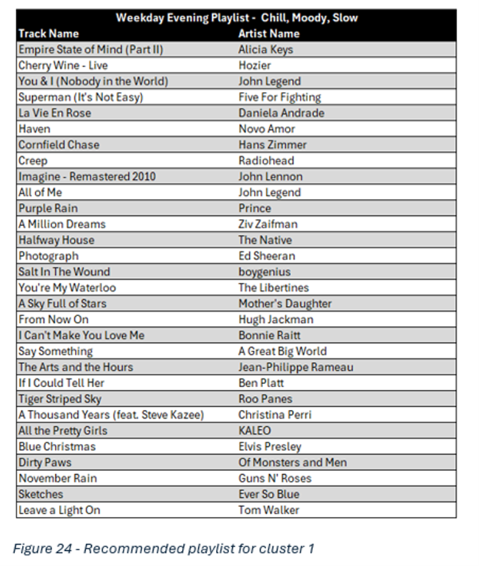
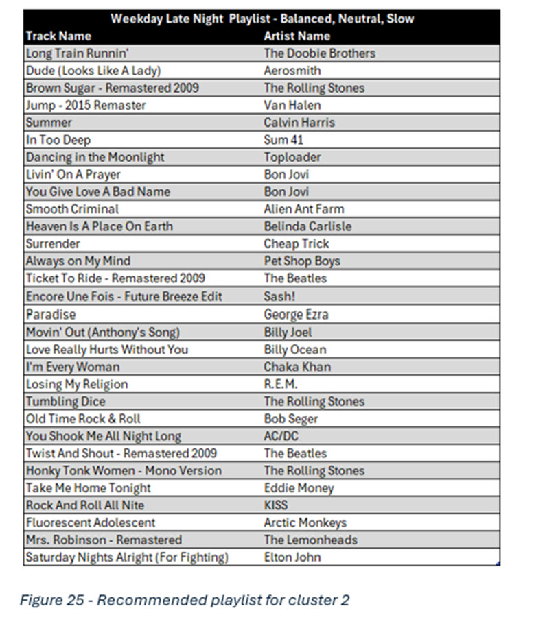

---

## 6. Reflections and recommendation

This project met its objectives by applying a reproducible, modular, and privacy-preserving workflow to identify distinct listening-day archetypes from personal Spotify data through unsupervised clustering. These archetypes proved to be interpretable and behaviourally meaningful, especially when overlaid with contextual life events that explained sustained structural shifts in listening patterns. The labelled outputs and visualisations allow concise communication of the evolution of listening behaviours over time, and the analysis was further operationalised through cluster-conditioned playlist generation to demonstrate practical value beyond description. 

However, key limitations must be acknowledged. Restricted Spotify API access and reliance on a partially complete static dataset for audio metadata constrained feature coverage, though core behavioural patterns remained robust. Looking ahead, future work should prioritise direct API integration to improve data richness and consider re-running the segmentation on separate time periods (notably pre vs post 2019) to account for observed structural changes in listening behaviour. These enhancements would build on the current framework’s strengths and further refine the personalised music recommendation outcomes derived from the analysis. 

---

## Appendix

**Appendix 1 - HuggingFace data showing content of the enriched data**

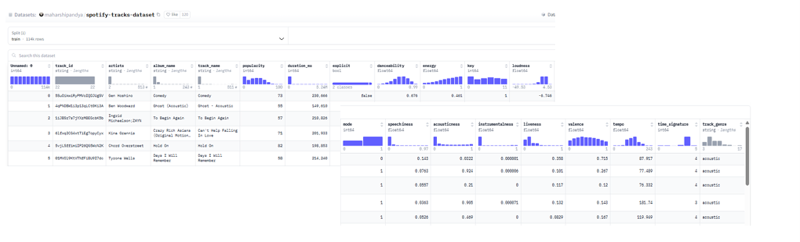
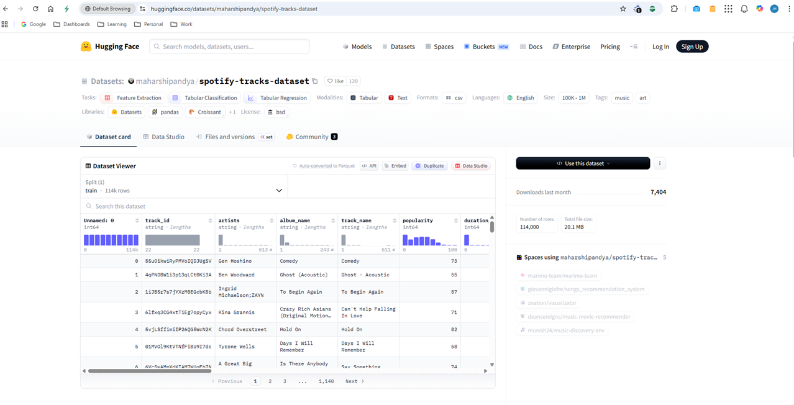

**Appendix 2 - HuggingFace column description of the enriched data**

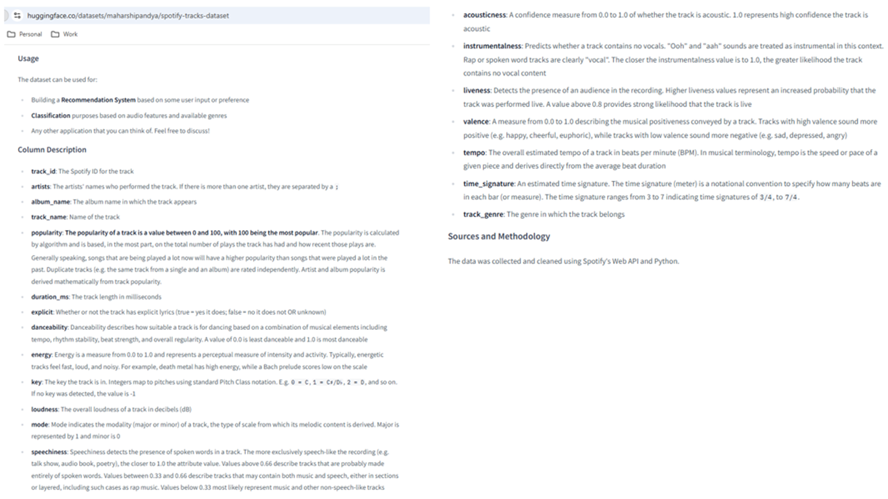

**Appendix 3 - EDA feature analysis**

Analysis of the audio feature distributions indicates that listening behaviour is characterised by rhythmically engaging and energetically driven music, with meaningful variation in emotional tone. Valence values span the full range, though with a greater concentration in mid to high scores, suggesting a general preference for neutral to emotionally positive tracks alongside a smaller proportion of more introspective listening. Tempo is predominantly centred within the mid range, indicating a focus on steady, accessible rhythms rather than extremely slow or fast music. This is complemented by a strong skew towards high energy, implying that tracks are typically intense, loud, and stimulating, with low energy music forming only a minor component of overall consumption. Danceability further reinforces this pattern, exhibiting a clear clustering around medium to high values, which reflects a consistent preference for rhythmically structured and groove oriented tracks. Taken together, these distributions suggest that listening behaviour is primarily oriented towards energetic, rhythm focused music suitable for everyday functional contexts, while still accommodating emotional diversity.

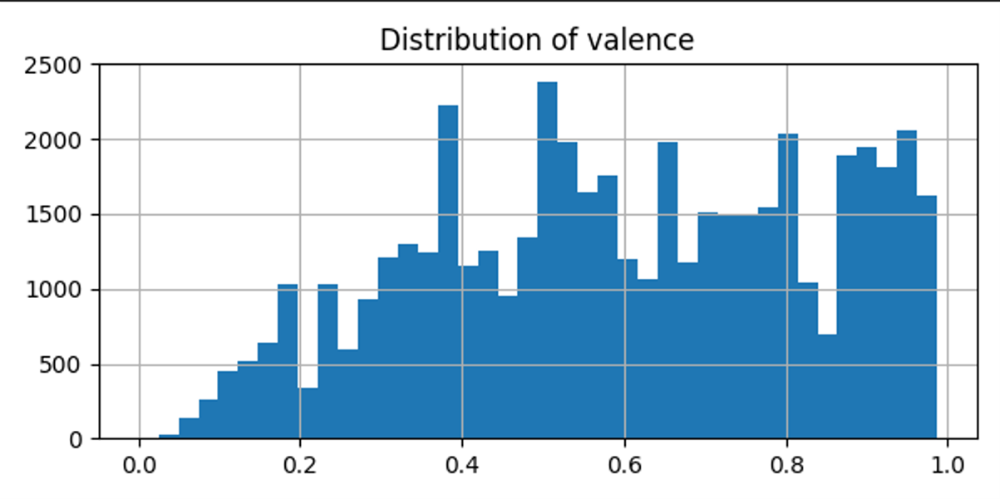

Valence represents the emotional positivity of a track on a scale from 0 to 1. The distribution shows that listening behaviour spans the full emotional range, with a noticeable concentration in mid to high valence values. This suggests a preference towards neutral and emotionally positive music, while lower valence (sad or melancholic) tracks are present but less frequent. Overall, the distribution indicates diverse emotional consumption rather than reliance on a single mood profile

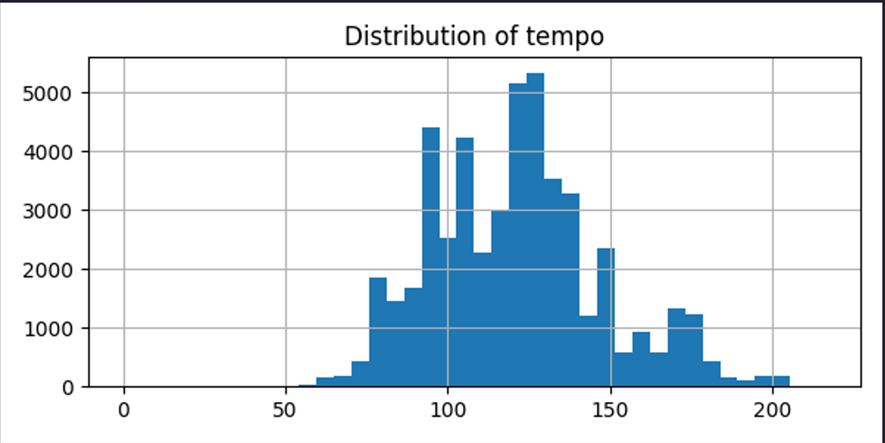

Tempo describes the speed of a musical track in beats per minute (BPM). The distribution indicates a strong preference for mid tempo music, with the majority of tracks falling between approximately 90 and 130 BPM. Slower tempos are present but less frequent, while very high tempo tracks form a small tail of the distribution. This suggests that listening behaviour is primarily oriented towards steady, accessible rhythms suitable for everyday contexts, rather than extremes of either low or high tempo

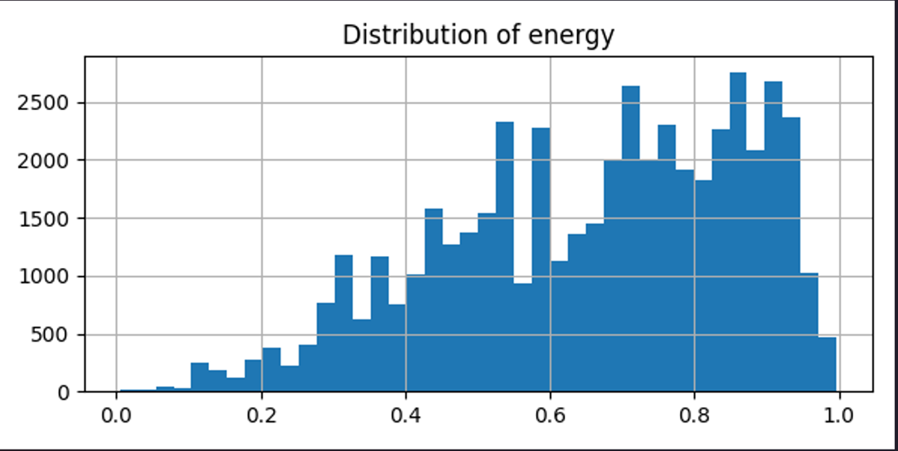

Energy reflects the perceived intensity and activity of a track, incorporating elements such as loudness, timbral density, and dynamic range. The distribution is heavily weighted towards high energy values, indicating that listening behaviour is predominantly oriented towards intense and engaging music. Low energy tracks are comparatively rare, suggesting that calm or ambient listening forms a minor component of overall music consumption.

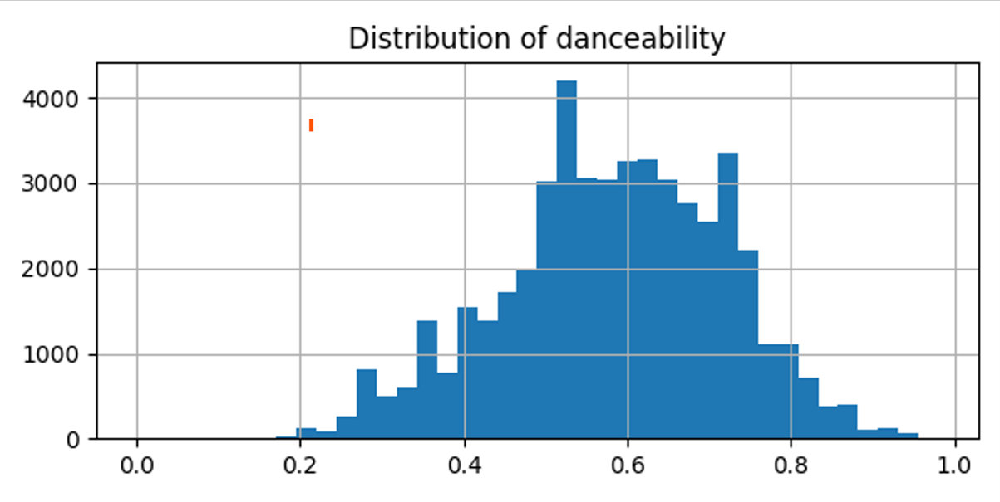

Danceability captures how suitable a track is for rhythmic movement, based on tempo stability, beat strength, and regularity. The distribution shows a strong concentration in mid to high danceability values, indicating a clear preference for rhythmically structured and groove oriented music. Tracks with very low danceability are relatively rare, suggesting that irregular or free tempo music plays a limited role in overall listening behaviour

**Appendix 4 – AI prompts**

**1)	Supporting the writing of documentation by suggesting formatting, summarisation, and grammar checks**

Task: Compress the following academic section.

Constraints:

•	Do not remove any methodological detail, assumptions, limitations, parameter choices, results, or interpretations.
•	Do not summarise at a higher level or abstract away technical content.
•	Preserve all analytical reasoning, justification of methods, and references to figures or results.
•	Maintain third person academic tone.
•	Do not add any additional information

Approach:

•	Combine sentences where ideas overlap.
•	Remove redundancy, filler language, and narrative scaffolding.
•	Increase information density by expressing the same ideas more concisely.

Output:

•	Return the fully rewritten compressed version only.
•	Do not add new content or references.

**2)	Assistance with debugging code or reviewing syntax in notebooks/scripts**

Many back and forth conversations were had with Co-Pilot regarding the best way to write code syntax in python and debugging where not working.  Extensive conversations were had regarding ways to resolve the security issues had when the Spotify certificate was not accepted by corporate security embedded within the laptop used for the project.

This is an example of the kind of prompts and responses which were being asked

prompt
If I ran this code in python, should I be seeing any outputs? 
I get the tick to say it has run but shows 0.0s and no output

def run_eda(plays: pd.DataFrame, out_dir: str): """Save simple EDA plots + CSV summarizing coverage and top artists.""" ensure_dir(out_dir) # Daily minutes daily = plays.groupby("local_date")["min_played"].sum().reset_index() plt.figure(figsize=(12,4)) plt.plot(pd.to_datetime(daily["local_date"]), daily["min_played"]) plt.title("Daily Music Minutes") plt.xlabel("Date"); plt.ylabel("Minutes") savefig(os.path.join(out_dir, "eda_daily_minutes.png")); plt.close() # Top 20 artists top_art = (plays.groupby("artist_name")["min_played"] .sum().sort_values(ascending=False).head(20)) plt.figure(figsize=(8,8)); top_art.sort_values().plot(kind="barh") plt.title("Top 20 Artists (by minutes)"); plt.xlabel("Minutes") savefig(os.path.join(out_dir, "eda_top_artists.png")); plt.close()

Response

Short answer:
If you only ran the cell that defines run_eda(...), then no — you won’t see any output, and a runtime like 0.0s is completely normal. That just means Python compiled the function definition and exited. You only get outputs when you call the function and it successfully writes files / prints.

**3)	Can you provide a list of 10 peer reviewed academic sources that support the argument I am making in the following paragraph.  Please provide working links to each of the pieces of literature where can be found online.**

This was a commonly used prompt designed to provide reading around the subject which was being discussed through various sections of the report.

**4)	Can you summarise this comparison of clustering methods into a simple table ready to use in a uni assignment so need to be clear, concise and well labelled. 
Method  / Advantages (Pros) /  Disadvantages (Cons)  / Best use cases**

K-Means 
• Simple & fast to implement; efficient on large datasets .
• Works well if clusters are well-separated, compact, and roughly spherical in shape .
• Easy to interpret results (cluster centroids are mean profiles of days). 
• Must pre-specify K (number of clusters) in advance ; choosing the “right” K can be challenging (can use Elbow method or silhouette analysis).
• Assumes clusters have similar size/density; struggles with non-spherical or unequal-sized clusters 
.• Sensitive to outliers – unusual days can distort the means and pull a cluster centroid . 

Hierarchical (Agglomerative) 
• No need to choose K upfront – can decide clusters by cutting the dendrogram at an appropriate level.
• Reveals a hierarchy of clusters (relationships between day types), which aids interpretation.
• Can find clusters at various scales (broad vs specific patterns) in one run.
• Works with many distance metrics & can handle different shapes depending on linkage method. 
• Computationally expensive for large datasets (merging clusters is O(n) or worse) ; not suitable for very large or real-time use.
• Results can be harder to visualize on very large data (dendrograms get complex).
• No automatic “noise” handling – every point gets clustered (unless you manually cut the tree to isolate outliers).
• Choice of linkage and distance metric can affect results; may need experimentation. 

DBSCAN (Density-Based) 
• No preset K required – finds the number of clusters automatically based on data density .• Can discover irregularly shaped clusters (not confined to circles/ellipses) – useful if day patterns vary in complex ways.
• Identifies outliers as noise instead of forcing them into clusters – good for capturing atypical days .
• Intuitive idea of clusters as areas of high listener activity density (e.g., days with consistently high listening form a cluster). 
• Parameter tuning required (distance ε and minPts); results sensitive to these choices and may require trial and error to get right.
• Struggles in high-dimensional data – hard to find a meaningful density threshold when each day has 50+ features .
• If clusters have very different densities, a single ε might merge or split clusters inappropriately.
• The outcome can be less stable for points near cluster boundaries (e.g., borderline days might flip between being labelled noise or part of a cluster depending on minor parameter changes).

Gaussian Mixture (GMM) 
• Soft clustering: yields probabilities for cluster membership – captures uncertainty and overlapping clusters .
• Can model clusters with different shapes and sizes by using covariance (not restricted to equal-sized spheres) .
• More statistically flexible: effectively a form of density modelling. If your “day types” aren’t cleanly separated, GMM can still model them as overlapping Gaussians. 
• Must choose number of Gaussian components (clusters) in advance (though methods like BIC/AIC can guide this).
• Computationally heavier than K-Means – slower on larger datasets or with many features • Assumes clusters are roughly Gaussian in feature distribution; may not fit well if real clusters are very non-Gaussian (or requires using multiple Gaussians per cluster).
• Results are more complex to interpret (requires understanding of probabilities and covariance).

This prompt was used to help create the table displayed in figure 10 which compares the different clustering techniques

### Full Jupyter Notebook

The complete Jupyter Notebook containing all code, data preparation,
and model outputs used in this analysis is available here:

[View the full Jupyter Notebook](notebook/spotify_analysis.ipynb)

## References

Achanta, A. (2023) Data Democratization: Empowering Non-Technical Users with Self-Service BI Tools and Techniques to Access and Analyze Data Without Heavy Reliance on IT Teams. International Journal of Computer Trends and Technology, 71(8), pp. 39–46. doi: 10.14445/22312803/IJCTT V71I8P106.

Al Naqbi, H., Bahroun, Z. and Ahmed, V. (2024) ‘Enhancing work productivity through generative artificial intelligence: A comprehensive literature review’, Sustainability, 16(3), 1166. https://doi.org/10.3390/su16031166

Bonnin, G. and Jannach, D. (2014) ‘Automated generation of music playlists: survey and experiments’, ACM Computing Surveys, 47(2), Article 26.

Creswell, J. W. and Plano Clark, V. L. (2018) Designing and Conducting Mixed Methods Research. 3rd edn. Thousand Oaks, CA: SAGE Publications.

Davenport, T.H. and Harris, J.G. (2017) Competing on Analytics: The New Science of Winning. Boston, MA: Harvard Business School Press.

Few, S. (2013) Information Dashboard Design: Displaying Data for At a Glance Monitoring. 2nd edn. Burlingame, CA: Analytics Press.

Ghosh, P. (2024) Self-Service Analytics: Pros and Cons. DATAVERSITY, 8 October. Available at: https://www.dataversity.net/articles/self-service-analytics-pros-and-cons/ (Accessed: 16 February 2026).

Hands, A. S. (2022) ‘Integrating quantitative and qualitative data in mixed methods research: An illustration’, The Canadian Journal of Information and Library Science, 45(1), pp. 1–20.

Hastie, T., Tibshirani, R. and Friedman, J. (2017) The Elements of Statistical Learning: Data Mining, Inference, and Prediction. 2nd edn. New York: Springer.

Jain, A. K. (2010) ‘Data clustering: 50 years beyond K-means’, Pattern Recognition Letters, 31(8), pp. 651–666.

Khatri, V. and Brown, C.V. (2010) ‘Designing data governance’, Communications of the ACM, 53(1), pp. 148–152.

Muddarla, B. and Vatti, P. R. (2024) ‘Machine learning in cloud environments: leveraging SQL and Python for big data analytics’, Nanotechnology Perceptions, 20(7), pp. 12–21.

Shutaywi, M. and Kachouie, N. N. (2021) ‘Silhouette analysis for performance evaluation in machine learning with applications to clustering’, Entropy, 23(6), p. 759. https://doi.org/10.3390/e23060759

Pandya, M. (2023) Spotify tracks dataset. Hugging Face. Available at: https://huggingface.co/datasets/maharshipandya/spotify-tracks-dataset (Accessed: 7 May 2026).

Vanam, L. (2023) ‘Strategic data democratisation: Enabling business users through self service business intelligence platforms’, Journal of Emerging Technologies and Innovative Research, 10(7), pp. 245–256.

